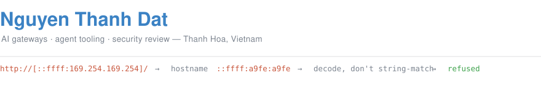

<div align="center">



[](https://github.com/search?q=author%3Antdat812+is%3Apr+is%3Amerged&type=pullrequests)
[](#security-research)
[](https://github.com/search?q=author%3Antdat812+is%3Apr+is%3Aopen&type=pullrequests)
[](#the-record)

**English** · [Tiếng Việt](README_vn.md)

</div>

Software engineer in Thanh Hoa, Vietnam. I work on AI gateways and agent tooling — the layer
between a coding agent and three hundred model providers, where one correctness bug becomes
every user's bug. I read the issue nobody has picked up, reproduce it, and follow it to the
line that is actually wrong.

Every patch below ships with a regression test that I verify fails on the base branch before I
open the pull request. Where a repository has no test runner, it carries a written reproduction
instead.

## The record

Counted **31 August 2026**, from `gh pr list -R <repo> --author ntdat812`, one repository at a
time. "Merged" means the change is in the upstream default branch of a repository I do not own.
Nothing in my own repositories is counted. Every number here links to the list behind it.

| | Count | What it counts |
| --- | ---: | --- |
| [Pull requests merged](https://github.com/search?q=author%3Antdat812+is%3Apr+is%3Amerged&type=pullrequests) | **27** | Landed in the default branch of a repo I don't own |
| [Closing someone else's issue](https://github.com/search?q=author%3Antdat812+is%3Apr+is%3Amerged&type=pullrequests) | **14** | Of those 27, the ones that close a filed issue |
| [Security advisories](#security-research) | **8** | Reported privately; six fixed, two still in triage |
| [Pull requests open](https://github.com/search?q=author%3Antdat812+is%3Apr+is%3Aopen&type=pullrequests) | **63** | Opened, awaiting review |
| Repositories | **10** | Third-party repos I've contributed to |

I hold no push, merge or admin right on any of these projects. Everything below was reviewed and
merged by somebody who does.

---

## Merged

**[diegosouzapw/OmniRoute](https://github.com/diegosouzapw/OmniRoute)** — MIT AI gateway, one
endpoint in front of 350 providers, 59.0k★. Twenty-two merged.
**[volcengine/OpenViking](https://github.com/volcengine/OpenViking)** — context database for
agents, 34.6k★. Two merged.
**[nicolargo/glances](https://github.com/nicolargo/glances)** — cross-platform system monitor,
33.4k★. Two merged.
**[lidge-jun/opencodex](https://github.com/lidge-jun/opencodex)** — universal provider proxy,
12.6k★. One merged.

Fourteen of the twenty-seven close an issue somebody else filed.
[Full list](https://github.com/search?q=author%3Antdat812+is%3Apr+is%3Amerged&type=pullrequests).
Fourteen that show the range:

| Pull request | What it fixes |
| --- | --- |
| [#10843](https://github.com/diegosouzapw/OmniRoute/pull/10843) `fix(security)` | An SSRF guard that matched cloud-metadata hosts by spelling instead of by address. Detailed below. |
| [#11328](https://github.com/diegosouzapw/OmniRoute/pull/11328) `fix(security)` | The canonical denylist of headers never forwarded upstream was missing two of the RFC 7230 hop-by-hop names, so `proxy-authorization` and `proxy-authenticate` went to the provider. |
| [glances #3692](https://github.com/nicolargo/glances/pull/3692) `fix(programs)` | Per-program I/O totals concatenated each process's counters instead of adding them, so a program's read and write figures came out as a list of its processes' numbers rather than their sum. |
| [opencodex #2476](https://github.com/lidge-jun/opencodex/pull/2476) `fix(responses)` | A 24 MiB state file was re-serialised and atomically replaced every two seconds whether or not anything in it had changed — and nothing reads it until the next start. The snapshot is now compared before it is written, by length and digest rather than by keeping the payload, and the debounce scales with the size. |
| [#11380](https://github.com/diegosouzapw/OmniRoute/pull/11380) `test(kimi)` | A nightly run reported one failure in 8,280 and it was being read as a Node 26 compatibility break. The test drew a random number and then asserted on the outcome. I fixed the test and said the issue should stay open, because a flaky test is not the thing it was filed about. |
| [#11376](https://github.com/diegosouzapw/OmniRoute/pull/11376) `fix(auth)` | Every upstream failure that was not already a string collapsed to the literal `Provider error`, and that is the line an operator reads. A refused port, a DNS failure, a blocked proxy and a provider simply saying no were indistinguishable — the actionable part sits on `error.cause.code`, which nothing looked at. |
| [#11319](https://github.com/diegosouzapw/OmniRoute/pull/11319) `fix(db)` | The proxy-URL validator refused private and cloud-metadata targets using its own dotted-quad regexes, so the same address in another spelling walked straight through. |
| [#10935](https://github.com/diegosouzapw/OmniRoute/pull/10935) `fix(relay)` | An earlier fix put the attacker-controlled `x-relay-path` behind a guard in the Deno and Vercel relay workers. The Cloudflare worker still concatenated it, so userinfo in the path re-pointed the request past the private-host check. |
| [#10868](https://github.com/diegosouzapw/OmniRoute/pull/10868) `fix(proxy)` | Every egress probe had moved to an IPv6-first endpoint, so an IPv4-only tunnel had no route to it, hung until the deadline, and a proxy carrying live traffic was reported dead. The strategy was wrong, not the constant. Closes [#9694](https://github.com/diegosouzapw/OmniRoute/issues/9694). |
| [#10862](https://github.com/diegosouzapw/OmniRoute/pull/10862) `fix(providers)` | Model sync did not fail on an upstream 401. It quietly degraded to a cached catalog, so a provider with dead credentials still looked healthy. Closes [#9683](https://github.com/diegosouzapw/OmniRoute/issues/9683). |
| [#10858](https://github.com/diegosouzapw/OmniRoute/pull/10858) `fix(context)` | Base64 documents were measured character by character, so a 1 MB PDF estimated at 350,022 tokens and the request was rejected before it ever left. Closes [#10840](https://github.com/diegosouzapw/OmniRoute/issues/10840). |
| [#10853](https://github.com/diegosouzapw/OmniRoute/pull/10853) `fix(i18n)` | Eight locales rendered the *status* "Disabled" as the noun for a person who has a disability. Closes [#10812](https://github.com/diegosouzapw/OmniRoute/issues/10812). |
| [OpenViking #4228](https://github.com/volcengine/OpenViking/pull/4228) `fix(ov_dream)` | A session message whose content was a plain string rather than a block list was not accepted. Closes [#4221](https://github.com/volcengine/OpenViking/issues/4221). |
| [OpenViking #4233](https://github.com/volcengine/OpenViking/pull/4233) `fix(memory-plugin)` | The URI guard meant to keep the memory plugin inside its own directory read a file's *content* as if it were the path, so what a document said decided where the plugin was allowed to read. Closes [#4188](https://github.com/volcengine/OpenViking/issues/4188). |

---

## One of them, in detail

`isCloudMetadataHost()` guards the classic SSRF pivot: an attacker who can steer an outbound
request at `169.254.169.254` reads the instance's IAM credentials. The code documented this
block as unconditional. It was not.

The guard compared the hostname against a set of dotted-decimal strings. But WHATWG `URL`
serialises an IPv4-mapped IPv6 literal as hextets, so the same address arrives wearing a
different spelling:

```
http://[::ffff:169.254.169.254]/
        │
        └─ new URL(…).hostname  ─►  "::ffff:a9fe:a9fe"
                                     │
                                     ├─ in CLOUD_METADATA_HOSTNAMES?  no
                                     └─ startsWith("169.254.")?        no
                                                                       │
                                            routes to 169.254.169.254 ─┴─►  allowed
```

The fix folds the embedded IPv4 back out before deciding — `a9fe` and `a9fe` are two hextets
that have to be decoded to `169.254.169.254`, not string-matched — so the verdict follows the
address rather than its spelling. Reading the surrounding function turned up a second gap:
`::` is the IPv6 twin of `0.0.0.0` and reaches a service on the IPv6 loopback, but only the
IPv4 spelling was refused. That is in the same patch.

Evidence I reported with it: the new test fails 10 of 12 cases on `release/v3.8.50` and passes
12 of 12 with the change; the guard's five existing suites stay green at 73 of 73.

**And the same shape keeps coming back.** A check that compares how something is *spelled*
against a list, when what decides the outcome is what it *is*. Since that patch I have found it
in a proxy-URL validator ([#11319](https://github.com/diegosouzapw/OmniRoute/pull/11319)), a
group pattern compiled into a `RegExp` without escaping
([#11311](https://github.com/diegosouzapw/OmniRoute/pull/11311)), a `--no-verify` block that
missed git's abbreviated long options ([ECC #2837](https://github.com/affaan-m/ECC/pull/2837)), the
same block again with `--config-env` as a second spelling of `-c`
([ECC #2858](https://github.com/affaan-m/ECC/pull/2858)),
a destructive-command classifier hidden by a `sudo` prefix
([ECC #2832](https://github.com/affaan-m/ECC/pull/2832)), and a dev-server block reading raw
text where it should read tokens ([ECC #2846](https://github.com/affaan-m/ECC/pull/2846)). The
fix is the same sentence every time: decide on identity, not on spelling.

Once I found it pointing the other way, which was the more useful lesson. A dedupe key compared a
usage row's millisecond and its fields, and two genuinely different requests compared equal, so one
was thrown away as a duplicate ([9router #3544](https://github.com/decolua/9router/pull/3544)). The
same confusion — spelling stood in for identity — but it merged two things instead of letting one
through. Whichever way it points, the question to ask the code is the same one.

---

## Security research

Eight vulnerabilities reported privately, each through the channel the project's `SECURITY.md`
asks for. **Six are fixed. Two are still in triage**, and I say nothing about those beyond the
count — they are unpatched, and describing them here would be the disclosure the process exists
to avoid.

Six of the eight went to OmniRoute, and all six are fixed. Two by patches I sent: the
cloud-metadata bypass described above, and the relay-path gap that
[#10935](https://github.com/diegosouzapw/OmniRoute/pull/10935) closed in the Cloudflare worker.

The other four were fixed upstream, with the advisory id named in the code that does
it — `GHSA-mghq-58h3-qcqj` and `GHSA-v7g9-7f55-5g46` on the always-protected route list in
`src/server/authz/routeGuard.ts`, `GHSA-wgwc-crjm-pmwv` on the loopback-only entry beside it,
and `GHSA-74g9-q8f6-793h` in
[#11417](https://github.com/diegosouzapw/OmniRoute/pull/11417), which carries the id in its
title and lands a regression test named after it.

The `mghq` / `v7g9` pair is the one I would point at. `GHSA-mghq` was the report. `GHSA-v7g9` is
what came out of going back and reading the fix instead of trusting it — two sibling routes had
been left behind, still reachable the same way as before. Re-reading a patch that has already
been accepted is not interesting work, and it is the step most people skip.

None of the eight was published as an advisory and none carries a CVE, so for the six that are
fixed the patched code is the only public record. Grep the repository for the ids.

---

## In review

Sixty-three open: twenty-seven on [9router](https://github.com/decolua/9router) (26.7k★), twelve
on [OpenViking](https://github.com/volcengine/OpenViking) (34.6k★), ten on
[ECC](https://github.com/affaan-m/ECC) (244k★), seven on
[ComfyUI](https://github.com/Comfy-Org/ComfyUI) (130k★), five on
[odysseus](https://github.com/odysseus-dev/odysseus) (86.6k★), and one each on
[OpenClaw](https://github.com/openclaw/openclaw) (388k★) and
[SurfSense](https://github.com/MODSetter/SurfSense) (16.0k★). Nothing of mine is left open on
OmniRoute, opencodex or Glances. Two of the OmniRoute ones closed as duplicates of pull requests
other people had filed a few hours earlier — same bug, same fix, and in both cases the diagnosis
was confirmed correct before the close.

That is a large number next to twenty-seven merged, and the honest reading is that most of it is
waiting rather than working: these are queues I do not control, and several of these projects
take weeks. What I can speak for is the state I leave them in. Checked on 31 August 2026, one
pull request at a time with `gh pr view --json statusCheckRollup`, because the list form of that
query returns an empty rollup and reads as green: fifty-nine of the sixty-three pass every check
their repository runs — with the caveat that thirty-one of those run no CI at all, so there was
nothing there to fail (twenty-seven on 9router, four older ones on OpenViking).

Four are red, and I would rather name them than round them off:

- [odysseus #6169](https://github.com/odysseus-dev/odysseus/pull/6169) and
  [#6166](https://github.com/odysseus-dev/odysseus/pull/6166) fail `Check PR description`, a
  repository gate that reports five faults in the description and points at a bot comment for the
  list. That comment was never posted — the same job logs two 404s deleting labels — so I have the
  count without the detail.
- [OpenClaw #127135](https://github.com/openclaw/openclaw/pull/127135) fails `check-lint` with
  exit 143: the runner took a shutdown signal 103 seconds into oxlint and the job was cancelled.
  That is infrastructure rather than lint, and re-running it needs write access I do not have.
- [SurfSense #1728](https://github.com/MODSetter/SurfSense/pull/1728) fails `Vercel`, which no
  fork pull request can pass — it needs a team member to authorise the deploy — and
  `recurseml/analysis`, which errored instead of reporting a finding.

I am leaving those stated rather than tidied away: a red check is worth more to a reader than a
claim that everything is green.
[Full list](https://github.com/search?q=author%3Antdat812+is%3Apr+is%3Aopen&type=pullrequests).

| Pull request | What it fixes |
| --- | --- |
| [SurfSense #1728](https://github.com/MODSetter/SurfSense/pull/1728) `fix(crawler)` | The crawler validated a target with `validators.url` alone, which judges spelling and not destination, so the cloud metadata endpoint and any loopback or private address were fetched from inside the backend's network. The guard resolves the host first and refuses unless every answer is publicly routable — including `::ffff:127.0.0.1`, whose `is_loopback` reads false until the mapping is unwrapped, and carrier-grade NAT, which the obvious five-flag check lets through. Closes [#1709](https://github.com/MODSetter/SurfSense/issues/1709). |
| [OpenClaw #127135](https://github.com/openclaw/openclaw/pull/127135) | Every request to an Alibaba Model Studio provider sent the output-token cap as `max_completion_tokens` — a field the vendor's own OpenAI-compatibility reference does not list. Closes [#127119](https://github.com/openclaw/openclaw/issues/127119). |
| [9router #3538](https://github.com/decolua/9router/pull/3538) `fix(transport)` | A model pinned to a different wire format got its body translated but not its destination: 9router serialised a Claude request and posted it to the provider's OpenAI endpoint, with that endpoint's auth. Upstreams parse what they recognise and drop the rest, so it half-worked. Closes [#3418](https://github.com/decolua/9router/issues/3418) and [#3439](https://github.com/decolua/9router/issues/3439). |
| [9router #3544](https://github.com/decolua/9router/pull/3544) `fix(usage)` | The dedupe query keyed a usage row on its millisecond timestamp plus the request's fields. Two genuine requests in the same millisecond compare equal, so one of them is discarded as a duplicate — 100 parallel writes recorded 2. The suite had been failing on `master`; it was read as a transaction race, and the driver is synchronous. |
| [9router #3522](https://github.com/decolua/9router/pull/3522) `fix(tunnel)` | The public subdomain a tunnel is published under was drawn from a predictable source, so the address meant to be unguessable could be guessed. |
| [9router #3517](https://github.com/decolua/9router/pull/3517) `fix(proxy)` | A loopback request was sent out through the configured outbound proxy, so a request to the machine itself left the machine. Closes [#3424](https://github.com/decolua/9router/issues/3424). |
| [ComfyUI #15841](https://github.com/Comfy-Org/ComfyUI/pull/15841) | A YAML list in `extra_model_paths.yaml` crashed the loader instead of being read as a list of paths. |
| [ComfyUI #15783](https://github.com/Comfy-Org/ComfyUI/pull/15783) | A model directory that links back to one of its own ancestors makes the walk re-enter the same tree at every level, so one model is listed over and over. Following links is deliberate; detecting the loop was missing. |
| [OpenViking #4229](https://github.com/volcengine/OpenViking/pull/4229) | A stale PID lock was honoured on macOS without checking that the process holding it was the one it claimed to be. Closes [#4210](https://github.com/volcengine/OpenViking/issues/4210). |
| [ECC #2858](https://github.com/affaan-m/ECC/pull/2858) | The guard that stops a commit from skipping its hooks knew `-c core.hooksPath=`. `git --config-env=core.hooksPath=VAR` is the same instruction read from the environment, and it was not on the list — so the hook did not run and the commit went through. Verified against git 2.51. |
| [ECC #2846](https://github.com/affaan-m/ECC/pull/2846) | The dev-server block decided the script name from raw text rather than from tokens. |
| [ECC #2837](https://github.com/affaan-m/ECC/pull/2837) | The guard blocking `--no-verify` compared the flag against that exact spelling. Git resolves any unambiguous prefix of a long option, so `--no-ver` skipped the hooks. |

---

## How I work

Four things I would rather be judged on than a language list. Each links to the artefact.

**I report what the tests actually said.** I could not get a green build on my Windows box for
[#10843](https://github.com/diegosouzapw/OmniRoute/pull/10843#issuecomment-5355999035), so
instead of ticking the box I showed the identical failure on a clean checkout of the base
branch, traced it to an optional native dependency, and said plainly that a real CI run would
be more authoritative than mine.

**I widen a report when the bug is wider.**
[#10812](https://github.com/diegosouzapw/OmniRoute/issues/10812) reported one bad Japanese
string. The same mistranslation was in eight locales and 24 strings, so
[#10853](https://github.com/diegosouzapw/OmniRoute/pull/10853) fixed all of them and added
glossary entries so the next translator does not repeat it.

**I build what was agreed, not what I would rather build.**
[opencodex #2476](https://github.com/lidge-jun/opencodex/pull/2476) had an obvious large answer —
replace the whole snapshot store with a journal. Triage had endorsed two narrow measures instead,
so I implemented those two and wrote in the pull request that the journal direction was
deliberately not attempted. It merged.

**I stand down when someone was there first.** I opened
[9router#3434](https://github.com/decolua/9router/pull/3434) eleven minutes after
[#3433](https://github.com/decolua/9router/pull/3433) fixed the same defect, having missed it
while checking for duplicates. I closed mine, said why, and
[left the two regression cases](https://github.com/decolua/9router/pull/3433#issuecomment-5364068109)
my branch covered on theirs.

---

## What I work on

Node, TypeScript, and Python. Streaming HTTP and server-sent events. Compatibility between the
OpenAI, Claude, and Gemini request shapes — where they agree on paper and diverge in practice.
Access control, SSRF review, and command-classification guards. Internationalisation, which
turns out to be a correctness problem more often than a translation one.

---

## Contact

[ntdat812.dev@gmail.com](mailto:ntdat812.dev@gmail.com)
